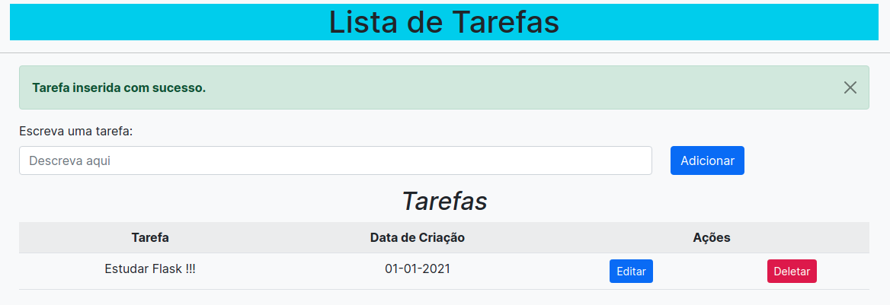

# Todo List com Flask e Python

Este repositório contém a implementação de um **Todo List** 
e utiliza as seguintes tecnologias: Python/Flask, HTML, JS,
CSS/Bootstrap, SQLite e SQLAlchemy.



## Execução
Para executar o projeto basta instalar as dependências contidas
no arquivo *requirements.txt* (em um ambiente virtual, se necessário),
executar o arquivo *utils.py* para criar a base de dados e
por fim executar o arquivo *run.py*.

```python3
pip install -r requirements.txt
python3 utils.py
python3 run.py
```

## Projeto
Seguindo algumas recomendações oficiais do Flask, o aplicativo
contém algumas divisões:
- `app`: pasta/pacote que contém os arquivos do projeto em si.
- app/`templates`: pasta que contém os arquivos HTML utilizados em todo projeto.
  O *Flask* detecta os templates utilizados automaticamente quando há essa pasta.
- app/`static`: pasta que contém os arquivos CSS e JS utilizadas nas páginas HTML.
- app/`__init__.py`: arquivo que contém a fábrica de aplicativos (inicia a aplicação) e 
  informa que a pasta *app* também é um pacote. 
- app/`models.py`: contém a entidade *Todo* que será armazenada na base de dados.
- app/`views.py`: contém as rotas e funções do aplicativo.
- `config.py`: contém configurações para execução do projeto.
- `run.py`: contém o comando para execução da aplicação (cria a instância do projeto contida em `__init__.py`).
- `utils.py`: contém o comando para a criação da base de dados.

## Observações
Este projeto está configurado para executar em modo *Debug*, 
pois não é um projeto comercial. Contudo, sinta-se a vontada
para mudar as configurações no arquivo `config.py` e utilizar 
este projeto para outros contextos.
